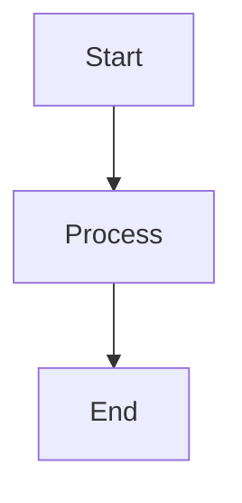

# Claude Code Instructions

## Project Overview

This is a Cookie Clicker optimizer bookmarklet that uses Cookie Monster's payback period calculations to recommend the most efficient purchase.

For project structure, commands, testing, and development workflows, see [DEVELOPMENT.md](DEVELOPMENT.md).

## Plan Mode

- Make the plan extremely concise. Sacrifice grammar for the sake of concision.
- At the end of each plan, give me a list of unresolved questions to answer, if any.

## Documentation

Always update `README.md` when making changes that affect user-facing functionality, such as:

- Adding new features or controls
- Changing existing behavior
- Modifying the UI

### Mermaid Diagrams

GitHub supports Mermaid diagrams in markdown. Use them to visualize flows and architecture:

````markdown

````

See [Mermaid documentation](https://mermaid.js.org/intro/) for syntax.

## Key APIs Used

### Cookie Clicker Game Object

- `Game.cookies` - Current cookie count
- `Game.cookiesPs` - Cookies per second
- `Game.Objects[name]` - Building data
- `Game.Upgrades[name]` - Upgrade data
- `Game.UpgradesInStore` - Available upgrades
- `Game.LoadMod(url)` - Load external mod

### Cookie Monster Data

- `CookieMonsterData.Objects1[name].pp` - Building PP for buying 1
- `CookieMonsterData.Objects10[name].pp` - Building PP for buying 10
- `CookieMonsterData.Objects100[name].pp` - Building PP for buying 100
- `CookieMonsterData.Upgrades[name].pp` - Upgrade payback period
- `CookieMonsterData.Cache` - Internal cache data
