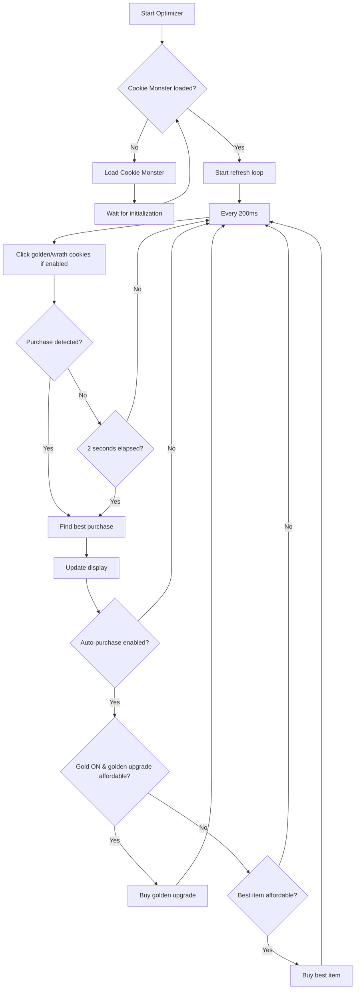

# Cookie Clicker Optimizer

<div align="center">

[](https://github.com/ianneub/cookie_clicker_optimizer/actions/workflows/deploy.yml)
[](https://opensource.org/licenses/ISC)

**Stop guessing. Start optimizing.**

A bookmarklet that displays the most efficient purchase in Cookie Clicker using [Cookie Monster](https://github.com/CookieMonsterTeam/CookieMonster)'s payback period calculations.

<h3>Quick Install</h3>

**[Get the Bookmarklet](https://ianneub.github.io/cookie_clicker_optimizer/)**

</div>

---

## TL;DR

**The Problem**: Cookie Clicker has dozens of buildings and upgrades. Manually calculating which purchase gives the best return is tedious and error-prone.

**The Solution**: This bookmarklet analyzes all available purchases and tells you exactly what to buy next, with optional auto-purchasing.

### Why Use This?

| Feature | What It Does |
|---------|--------------|
| **Best Purchase Display** | Shows the optimal item based on Payback Period (lower = better) |
| **Auto-Purchase** | Automatically buys the best item when you can afford it |
| **Golden Cookie Handling** | Auto-clicks golden/wrath cookies, prioritizes golden upgrades |
| **Lucky Bank Protection** | Reserves cookies for max Lucky rewards (phase-aware scaling) |
| **Wrinkler Management** | Tracks wrinkler rewards, suggests when to pop for faster progress |

---

## Quick Start

1. Open [Cookie Clicker](https://orteil.dashnet.org/cookieclicker/)
2. Click your bookmarklet
3. A floating panel appears showing your best purchase


---

## How It Works

The optimizer uses Cookie Monster's **Payback Period (PP)** metric to rank purchases:

- **Time to afford** the item (if you don't have enough cookies)
- **Time to pay for itself** through increased CpS
- **Synergies** from achievements and bonuses

**Lower PP = Better purchase**



---

## Installation

### Quick Install (Recommended)

Visit the **[Installation Page](https://ianneub.github.io/cookie_clicker_optimizer/)** and drag the bookmarklet to your bookmarks bar.

### Manual Installation

1. Copy the entire contents of `bookmarklet.txt`
2. Create a new bookmark in your browser
3. Name it "CC Optimizer"
4. Paste the copied text as the bookmark URL

### Browser Console

```javascript
// Copy contents of dist/main.global.js and paste into DevTools Console (F12)
```

---

## Controls

| Control | Action |
|---------|--------|
| **Auto: OFF/ON** | Toggle automatic purchasing |
| **Gold: OFF/ON** | Toggle golden cookie auto-clicking |
| **Wrath: OFF/ON** | Include wrath cookies (visible when Gold ON) |
| **Wrnk: OFF/ON** | Auto-pop wrinklers when beneficial (visible during Grandmapocalypse) |
| **Drag header** | Move panel anywhere |
| **Click X** | Close panel |
| **Click bookmarklet again** | Toggle off |
| **`CCOptimizerStop()`** | Stop from console |

---

## Features

### Auto-Purchase Mode

When enabled, automatically buys the best PP item as soon as affordable. Disabled by default.

### Golden Cookie Mode

When **Gold: ON**:
- Auto-clicks golden cookies instantly
- Shows "Golden Priority" section for spawn-rate upgrades
- Prioritizes golden upgrades when combined with Auto
- **Wrath** toggle appears for red cookies

Test with: `new Game.shimmer('golden')` in console

### Lucky Bank Protection

Reserves cookies for max Lucky + Frenzy rewards. Scales by game phase:

| Phase | CpS Range | Bank Protection | Golden Upgrade Priority |
|-------|-----------|-----------------|------------------------|
| Early | < 1M | 0% (disabled) | Only if < 30 min |
| Mid | 1M - 100M | Scales 0% → 100% | Up to 4 hours |
| Late | > 100M | 100% (full) | Up to 12 hours |

**Why?** Lucky gives `min(15% of bank, 900 × CpS)`. During Frenzy, you need 42,000 × base CpS banked for max reward.

### Wrinkler Management

During Grandmapocalypse:
- Shows wrinkler count and pop reward
- Highlights shiny wrinklers (3.3× reward, never auto-popped)
- Suggests when popping enables faster purchases

---

## Comparison

| Feature | This Optimizer | Cookie Monster Only | Manual Play |
|---------|---------------|---------------------|-------------|
| Best purchase recommendation | ✅ Floating panel | ⚠️ Hover tooltips | ❌ Mental math |
| Auto-purchasing | ✅ One click | ❌ Manual | ❌ Manual |
| Golden cookie handling | ✅ Auto-click + prioritize | ⚠️ Notifications only | ❌ Watch constantly |
| Lucky bank management | ✅ Phase-aware auto | ⚠️ Manual tracking | ❌ Guesswork |
| Wrinkler optimization | ✅ Pop suggestions | ⚠️ Shows reward only | ❌ Guesswork |
| Setup time | ✅ ~5 seconds | ⚠️ ~30 seconds | N/A |

---

## Development

```bash
npm install          # Install dependencies (first time)
npm run build        # Build TypeScript + generate bookmarklet
npm test             # Run tests
npm run typecheck    # Type checking
```

See [DEVELOPMENT.md](DEVELOPMENT.md) for detailed project structure and workflows.

### Key Files

| Path | Purpose |
|------|---------|
| `src/` | TypeScript source code |
| `dist/main.global.js` | Bundled JavaScript |
| `bookmarklet.txt` | Generated minified bookmarklet |

---

## Troubleshooting

### Panel not appearing

```bash
# Check browser console for errors (F12 → Console)
# Ensure you're on orteil.dashnet.org/cookieclicker/
```

### Cookie Monster timeout

If you see "Timeout waiting for Cookie Monster":
1. Refresh the Cookie Clicker page
2. Wait for game to fully load
3. Click bookmarklet again

### Auto-purchase not buying

- Check if **Auto: ON** is enabled (green)
- If **Gold: ON**, it may be saving for a golden upgrade
- Check Lucky Bank status - may be protecting cookie reserve

---

## FAQ

### Is this cheating?

That's up to you. This tool automates decisions but doesn't hack the game. It uses the same calculations Cookie Monster provides - just with automation.

### Why Cookie Monster?

Cookie Monster has years of refinement on its PP calculations, accounting for synergies, achievements, and edge cases. Why reinvent the wheel?

### Can I use without auto-purchase?

Yes! By default, auto-purchase is OFF. The panel just shows recommendations - you decide when to buy.

### Does it work on Steam version?

No, this is for the [web version](https://orteil.dashnet.org/cookieclicker/) only.

---

## Credits

- [Cookie Monster](https://github.com/CookieMonsterTeam/CookieMonster) - Powers the PP calculations
- [Cookie Clicker](https://orteil.dashnet.org/cookieclicker/) by Orteil
