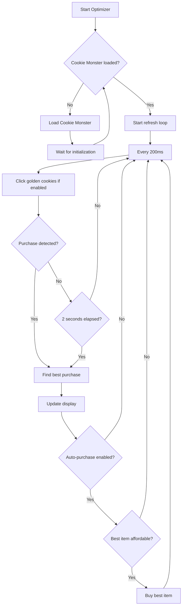
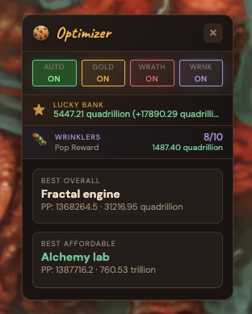

# Cookie Clicker Optimizer

A bookmarklet that displays the most efficient purchase in Cookie Clicker using a floating on-screen panel. Leverages [Cookie Monster](https://github.com/CookieMonsterTeam/CookieMonster)'s payback period calculations.

## How It Works

The optimizer uses Cookie Monster's **Payback Period (PP)** metric to rank all available purchases. PP accounts for:
- Time to afford the item (if you don't have enough cookies yet)
- Time for the purchase to pay for itself through increased CPS
- Achievement synergies and other bonuses

**Lower PP = Better purchase**



## Installation

### Quick Install (Recommended)

Visit the **[Installation Page](https://ianneub.github.io/cookie_clicker_optimizer/)** and drag the bookmarklet to your bookmarks bar.

### Manual Installation

1. Copy the entire contents of `bookmarklet.txt`
2. In your browser, create a new bookmark
3. Name it something like "CC Optimizer"
4. Paste the copied text as the bookmark URL
5. Save the bookmark

### Browser Console

1. Open Cookie Clicker in your browser
2. Open Developer Tools (F12 or Ctrl+Shift+I)
3. Go to the Console tab
4. Copy and paste the contents of `optimizer.js`
5. Press Enter

## Usage

1. Open [Cookie Clicker](https://orteil.dashnet.org/cookieclicker/)
2. Click your bookmarklet to start the optimizer
3. A floating panel appears in the top-left corner

The first time you run it, Cookie Monster will be automatically loaded if not already present (this may take a few seconds).

### Controls

- **Auto: OFF/ON** - Toggle automatic purchasing of the best item when affordable
- **Gold: OFF/ON** - Toggle automatic clicking of golden cookies
- **Wrath: OFF/ON** - Toggle automatic clicking of wrath cookies (only visible when Gold is ON)
- **Click bookmarklet again** - Toggle off (stops and removes panel)
- **Drag the header** - Move the panel anywhere on screen
- **Click X** - Close the panel
- **`CCOptimizerStop()`** - Stop from console

## Features

### Auto-Purchase Mode

Click the **Auto: OFF** button in the panel header to enable automatic purchasing. When enabled:

- The optimizer will automatically buy the **best overall** item as soon as you can afford it
- Purchases happen instantly with no delay
- Toggle off at any time by clicking the button again (shows **Auto: ON** when active)
- Disabled by default - you must explicitly enable it

### Golden Cookie Auto-Clicker

Click the **Gold: OFF** button to enable automatic clicking of golden cookies. When enabled:

- Golden cookies are clicked instantly when they appear (checks every 200ms)
- A **Wrath: OFF** toggle appears to optionally include wrath cookies (red cookies during Grandmapocalypse)
- Both toggles are disabled by default
- Test with `new Game.shimmer('golden')` in the browser console to spawn a golden cookie

### Auto-Refresh
The optimizer automatically updates:
- Every **2 seconds**
- **Immediately** after any purchase (building or upgrade)

### On-Screen Display
A compact floating panel shows:
- **Best Overall** - The most efficient purchase (lowest PP)
- **Best Affordable** - What you can buy right now (if different)
- **[BUY]** indicator when you can afford the best item
- Cookies needed if you're saving up

### Example Display



## Files

- `optimizer.js` - Full source code with comments
- `bookmarklet.txt` - Minified version for bookmark installation (generated)
- `build-bookmarklet.js` - Build script
- `README.md` - This file

## Development

To modify the optimizer:

1. Edit `optimizer.js`
2. Run `npm run build` to regenerate the bookmarklet
3. Copy the new `bookmarklet.txt` contents to your bookmark

```bash
npm install     # Install dependencies (first time only)
npm run build   # Build the bookmarklet
```

## Dependencies

This tool automatically loads [Cookie Monster](https://github.com/CookieMonsterTeam/CookieMonster) to handle the complex efficiency calculations. Cookie Monster also provides useful tooltip overlays showing PP values directly in the game UI.

## Credits

- [Cookie Monster](https://github.com/CookieMonsterTeam/CookieMonster) - The addon that powers the PP calculations
- [Cookie Clicker](https://orteil.dashnet.org/cookieclicker/) by Orteil
